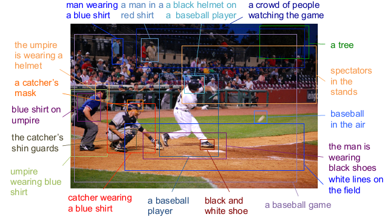
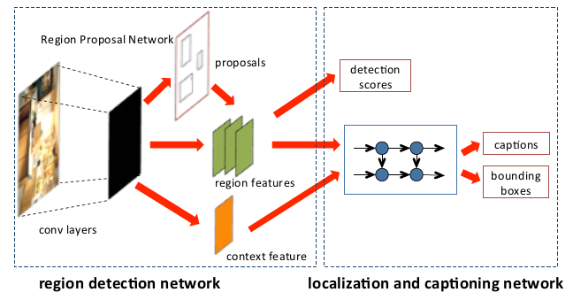
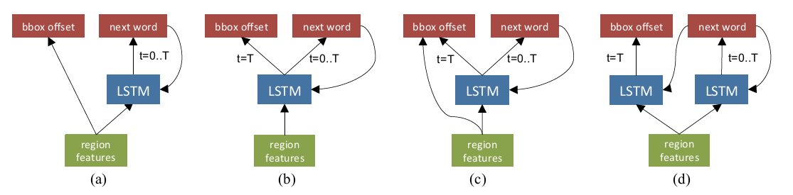
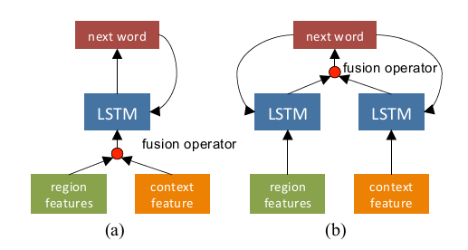
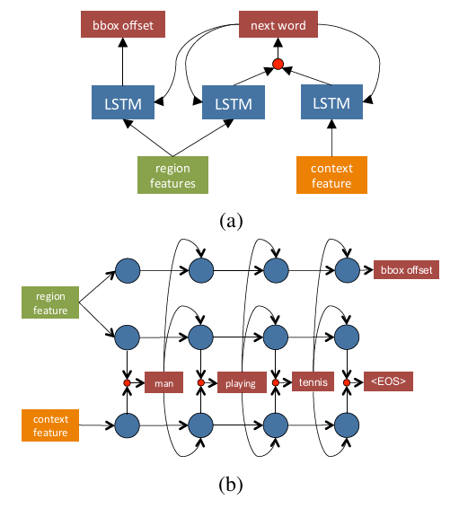

## 论文信息

| 类别     | 内容                                                         |
| -------- | ------------------------------------------------------------ |
| 论文名称 | [Dense Captioning with Joint Inference and Visual Context](https://arxiv.org/abs/1611.06949v2) |
| 发表时间 | CVPR 2017                                                    |
| 作者     | [Linjie Yang](https://arxiv.org/search/cs?searchtype=author&query=Yang%2C+L), [Kevin Tang](https://arxiv.org/search/cs?searchtype=author&query=Tang%2C+K), [Jianchao Yang](https://arxiv.org/search/cs?searchtype=author&query=Yang%2C+J), [Li-Jia Li](https://arxiv.org/search/cs?searchtype=author&query=Li%2C+L) |
| 关键词   | Image Captioning, Dense Captioning                           |

## 核心信息

### 文章领域及方向

CV & NLP，Dense Captioning 问题

### 文章概要

本文提出了Joint Inference与Context Fusion这两种新方法来解决在Dense Captioning任务中出现的问题。这两种方法利用图片的整体环境信息与物体周围的局部信息，生成对感兴趣区域（Region of Interest, ROI）的描述与检测框的偏移值，在综合得分（mean Average Precision, mAP）指标上达到了当时的state-of-the-art水平。

<!-- more --> 

## 引言

### 数据集内对图像的描述存在的问题

1. 只关注图像中**显著的物体**，或倾向于描绘**画面整体**，不能完整地反映**对图像的完整理解**。
2. 图像描述较为**主观**，使得captioning任务的结果难以进行评价。

### 什么是Dense Captioning ?

1. Dense Captioning是针对上述问题所提出的图像标注任务。
2. 在Dense Captioning任务中，标注者或机器将会**尽可能多地**框出图像中出现的**视觉概念物**（如：物体，物体的部分，物体间的交互情况）。
3. 与传统Captioning任务不同的是，Dense Captioning任务中物体的集合是开放的，即对物体的标注不受**有效物体集合**的限制。此外，它也关注**物体的部分**和**多物体间的交互**情况。
4. Dense Captioning相较于传统的captioning方法更加**客观**，更难受到标注者偏见的影响。下图为Dense Captioning的一个例子。

   

### 当前Dense Captioning任务的解决步骤

1. Region Proposal：通过RPN （Region Proposal Network） 生成潜在目标所在的区域框，划分出**感兴趣区域** （Region of Interest，**RoI**）。
2. 通过预测网络，对每个RoI生成以下**三个指标**：
   1. 检测得分（与物体检测任务中相似）
   2. 描述RoI内容的短语
   3. bounding-box offset（检测框偏移量，对检测框的调整参数，一般包括平移和缩放两部分）

### Dense Captioning任务存在的两个难题

1. 物体检测框的**数量多**，并且常常**高度重叠。**
2. 部分物体脱离**环境**难以正确描述。

### 解决上述难题的两个方法

1. **Joint Inference** （联合推理，通过综合从RoI与环境中提取出的特征，对RoI的检测框偏移量进行生成与调整）
2. **Context Fusion**（环境融合，通过综合从RoI与环境中提取出的特征，来生成更好的RoI描述）

### 本文的贡献

1. 设计了包含两个关键方法的网络结构来解决Dense Captioning中遇到的问题。
2. 在模型结构方面进行了广泛实验，并对他们背后的机理进行了分析，最终得到了紧凑且有效的 state-of-the-art 模型。

## 模型信息

解决该问题的模型由**两部分**组成：Region Detection Network（生成RoI，提取RoI特征与环境特征）与 Localization and Captioning Network（生成检测得分，描述短语和偏移量）

对于模型的第一部分，我们使用基于CNN的**RPN**（受到 **faster R-CNN** 的启发）。以下将对模型的第二部分进行详细描述。

### Joint Inference：获取准确的localization

Localization包括生成RoI与bbox offset两部分，而在此部分**bbox offset**是我们的主要关注对象。本文共提出了4种Joint Inference方法来生成bbox offset：

(a) : Baseline model —— bbox offset仅由RoI特征生成

(b) : Shared-LSTM (S-LSTM) —— 用已有LSTM层的最后一步输出生成offset

(c) : Shared-Concatenation-LSTM (SC-LSTM) —— 合并LSTM的输出与RoI特征生成offset（类似于ResNet）

(d) : Twin-LSTM (T-LSTM) —— 用两个LSTM网络分别生成caption与location。当caption完成时，location-LSTM此时收到完整的图像描述信息，并用整个caption作为输入生成offset。

### Context Fusion：获取准确的description

当前利用环境信息完成Sequential Prediction任务（如Image Captioning）的尝试较为有限。本文着重于**更好地结合**整体环境特征与局部RoI特征完成Dense Captioning任务，而不是寻找环境特征的更好表示方法。因此，此处采用**将图片内所有的ROI的特征整合**后作为环境特征的简单方法。

本文共提出了两种Context Fusion方法来生成caption文本：

(a) Early-fusion —— 将局部RoI特征与整体环境特征通过fusion-operator**处理后送入**LSTM，生成描述文本。

(b) Late-fusion —— 将两种特征分别送入**独立的LSTM**进行处理，将**处理的结果**通过fusion-operator生成描述文本。

其中，**fusion-operator**共有三种：合并，相乘，求和。

### 模型整合

上文所提到的组件可以任意选择进行组合，产生不同的模型结构。以上为使用T-LSTM与Late-fusion的整合模型示意图。其中图 (b) 为图 (a) 中LSTM单元展开的形式。

> 注意：在LSTM单元的每一步生成Caption中的一个单词，在LSTM单元的最后一步生成offset。

## 模型训练与评估

### 数据集与评价指标

数据集：Visual Genome V1.0 & V1.2 （77K train, 5K val, 5K test） 

评价指标：

1. Localization部分 ：IoU（Intersection-over-Union），阈值分别为 0.3, 0.4, 0.5, 0.6, 0.7。
2. Description部分 ：Meteor，阈值分别为 0, 0.05, 0.1, 0.15, 0.2, 0.25。
3. 总体评价指标：mAP（mean Average Precision），与[本文](https://arxiv.org/abs/1511.07571)相同。

### 训练过程

| 类别            | 描述                                                         |
| --------------- | ------------------------------------------------------------ |
| 优化方法        | 随机梯度下降（SGD）                                          |
| mini-batch size | 采用的值为1                                                  |
| 输入图片维度    | 图像调整为 600 x 720 像素                                    |
| 学习率          | 初始0.001，每100K次迭代后减半                                |
| momentum        | 0.98                                                         |
| 权重衰减        | 未使用                                                       |
| fine-tuning     | 200K次迭代（~3 epochs）后开始调整CNN，600K次迭代（~9 epochs）后停止训练。CNN的前七层不参加调整。 |

其他细节：

1. 融合了语境信息的模型直接训练难以收敛，因此先训练不融合语境信息的模型（600K次迭代），再在此基础上进行fine-tuning。
2. 词库大小为10K，最大描述长度为10词。
3. 为提高效率，在描述的生成阶段使用了beam-size为1的集束搜索（即贪婪算法）。

### 训练结果

1. Joint Inference方面，T-LSTM表现最佳（mAP超出其他方法约30%）。
   原因：S-LSTM同时生成caption与offset，不属于同一类别的信息，效果不佳。
   
2. Context fusion方面，Late-fusion优于Early-fusion。
原因：Early-fusion将局部信息与全局信息直接整合，而这两种信息存在显著的视觉差异，在后续的阶段难以分离。

3. 整体模型方面，环境信息对结果产生了较大提升（mAP 1.10）。其中，fusion-operator采用合并或相乘取得了相似的更好结果（较求和而言）。

4. 最好的模型：T-LSTM + Late-fusion + multiplication（mAP == 8.60）。